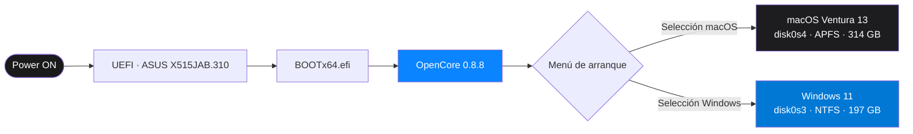

<div align="center">

# Hackintosh · ASUS VivoBook X515JA

**macOS Ventura 13 corriendo nativamente en hardware no Apple**  
Dual Boot con Windows 11 · Un único disco SSD de 512 GB · Sin USB externo


</div>

---

> ⚠️ **Aviso legal:** La instalación de macOS en hardware no oficial de Apple viola su EULA. Este repositorio tiene carácter **exclusivamente educativo y de documentación técnica personal.**

---

## ¿Qué es esto y por qué importa?

En 3 días, partiendo de cero y sin guía específica para este modelo, se consiguió:

- Instalar **macOS Ventura 13 de forma nativa** en un portátil ASUS con Intel Ice Lake
- Mantener **dual boot estable con Windows 11** en el mismo disco, sin USB externo
- Diagnosticar y resolver **dos crisis críticas** que dejaron el sistema completamente inutilizable
- Reinstalar Windows 11 desde cero tras corrupción del gestor de arranque
- Documentar cada decisión técnica, cada error y cada solución

Este proyecto no es solo instalar un sistema operativo. Es **diagnóstico de hardware, análisis de compatibilidad, gestión de arranque EFI, recuperación de sistemas bloqueados y resolución de problemas bajo presión**, todo en un entorno real y sin red de seguridad.

---

## Hardware

### Portátil objetivo

| Componente | Especificación | Compatibilidad |
|---|---|:---:|
| **CPU** | Intel Core i7-1065G7 · Ice Lake · 10ª gen · 4C/8T · 1.3–3.9 GHz | ✅ Perfecta |
| **GPU** | Intel Iris Plus Graphics (integrada) | ✅ Buena |
| **Trackpad** | ELAN 1200 I2C | ✅ Buena |
| **Audio** | Intel Smart Sound Technology | ✅ Buena |
| **SSD** | Micron 2450 · 512 GB NVMe | ✅ Perfecta |
| **WiFi** | Realtek 8821CE | ❌ Sin soporte |
| **BIOS** | American Megatrends X515JAB.310 · UEFI | — |
| **RAM** | 20 GB DDR4 3200 MHz | ✅ — |

### Máquina host (entorno de trabajo)

| Componente | Especificación |
|---|---|
| CPU | Intel Core i9-13900F |
| RAM | 32 GB DDR5 |
| GPU | NVIDIA RTX 5060 |
| SO | Windows 11 Enterprise |

---

## Arquitectura del sistema

### Flujo de arranque



### Esquema de particiones

```
┌──────────────────────────────────────────────────── SSD NVMe 512 GB ────┐
│  disk0s1        │  disk0s2   │    disk0s3           │    disk0s4         │
│  EFI (FAT32)    │  MS Rsvd   │    Windows 11         │    Macintosh HD    │
│  272.6 MB       │  16.8 MB   │    197.1 GB (NTFS)    │    314.7 GB (APFS) │
│  OpenCore 0.8.8 │            │                       │                    │
└─────────────────────────────────────────────────────────────────────────┘
```

### Estructura de la EFI

```
EFI/
├── BOOT/
│   └── BOOTx64.efi              ← Punto de entrada del firmware UEFI
└── OC/
    ├── OpenCore.efi             ← Bootloader principal
    ├── config.plist             ← Configuración completa (XML)
    ├── ACPI/                    ← SSDTs para corrección de hardware
    ├── Drivers/
    │   ├── HfsPlus.efi          ← Lectura de particiones HFS+/APFS
    │   ├── OpenRuntime.efi      ← Gestión de memoria y NVRAM
    │   ├── AudioDxe.efi         ← Audio en el menú de arranque
    │   └── OpenCanopy.efi       ← Interfaz gráfica del menú
    ├── Kexts/                   ← 30+ extensiones del kernel
    │   ├── Lilu.kext            ← Base: requerida por todos los demás
    │   ├── VirtualSMC.kext      ← Simula el chip SMC de los Mac reales
    │   ├── WhateverGreen.kext   ← Parches gráficos Intel Iris Plus
    │   ├── AppleALC.kext        ← Audio Intel Smart Sound (layout-id 21)
    │   ├── VoodooI2C.kext       ← Controlador base I2C
    │   ├── VoodooI2CHID.kext    ← Trackpad ELAN 1200 con gestos
    │   ├── AsusSMC.kext         ← Teclas Fn específicas del ASUS
    │   └── SMCBatteryManager    ← Batería y estado de carga
    └── Tools/
        └── OpenShell.efi        ← Shell EFI de emergencia (crítico)
```

---

## Decisiones técnicas

> Esta sección es el núcleo del proyecto. Cada decisión fue evaluada, y cada alternativa descartada tiene un motivo técnico concreto.

### ¿Por qué OpenCore y no Clover?

| Criterio | OpenCore 0.8.8 | Clover |
|---|---|---|
| Soporte macOS moderno | ✅ Completo | ⚠️ Limitado en Ventura+ |
| Inyección de kexts | ✅ En memoria, sin tocar el sistema | ❌ Modifica archivos del sistema |
| Mantenimiento activo | ✅ Actualizaciones frecuentes | ⚠️ Desarrollo reducido |
| Soporte SecureBootModel | ✅ Nativo | ❌ Sin soporte |
| Documentación actualizada | ✅ Dortania Guide activo | ⚠️ Desactualizada |

**Decisión:** OpenCore es el estándar actual para Hackintosh moderno. Clover fue descartado por su modelo de inyección invasivo y falta de soporte para Ventura.

---

### ¿Por qué SMBIOS MacBookAir9,1?

El SMBIOS define qué modelo de Mac simula el sistema ante macOS. Una elección incorrecta causa kernel panics, problemas de energía y funciones incompatibles con el hardware real.

**MacBookAir9,1 = MacBook Air 2020 (Intel)**

- Usa exactamente el mismo CPU: **Intel Core i7-1065G7 (Ice Lake)**
- Comparte la misma GPU integrada: **Intel Iris Plus Graphics**
- Las tablas de energía y perfiles de rendimiento coinciden con el hardware del portátil

| SMBIOS evaluado | Motivo del descarte |
|---|---|
| `MacBookPro16,2` | CPU diferente, perfiles de energía incorrectos para Ice Lake |
| `MacBookAir8,2` | Whiskey Lake (8ª gen) — generación anterior, incompatible |
| `MacBookAir9,1` | ✅ Elegido — mismo CPU, misma GPU, misma generación |

---

### ¿Por qué macrecovery.py y no Etcher/Rufus/Ventoy?

Las imágenes de macOS usan el sistema de archivos **HFS+/APFS**, que Windows no puede leer ni escribir de forma nativa. Las herramientas convencionales asumen FAT32 o NTFS y fallan.

| Herramienta | Error | Causa |
|---|---|---|
| Ventoy | `Invalid ISO size` | No reconoce el formato de imagen de macOS |
| balenaEtcher | `Missing partition table` | Las ISOs de macOS no tienen tabla MBR estándar |
| Rufus | `Tipo de imagen no soportada` | Sin soporte para HFS+/APFS |

**Solución:** `macrecovery.py` (herramienta oficial de OpenCore) descarga el recovery directamente de los servidores de Apple:

```bash
python macrecovery.py -b Mac-4B682C642B45593E -m 00000000000000000 download
# Resultado: BaseSystem.dmg (673 MB) + BaseSystem.chunklist verificado
```

> Apple bloquea descargas desde IPs externas con error 403. Se probaron múltiples Board IDs hasta encontrar uno válido para Ventura.

---

### ¿Por qué el WiFi no funciona? (y no es un error de configuración)

El portátil tiene un chip **Realtek 8821CE**. El único kext de WiFi disponible para Hackintosh, `AirportItlwm`, pertenece al proyecto [OpenIntelWireless](https://github.com/OpenIntelWireless/itlwm) y **solo soporta chips Intel**.

La razón es estructural: Apple utiliza en sus Mac una pila de drivers WiFi propia basada en chips **Broadcom** (modelos anteriores) e **Intel** (modelos recientes). Realtek nunca ha formado parte del ecosistema Apple. No existe ningún kext con soporte para el 8821CE. No es un problema de versión ni de configuración — es una **incompatibilidad a nivel de arquitectura de drivers**.

**Próximos pasos:**
- Adaptador USB WiFi compatible con macOS (Ralink RT5370 o similar)
- Investigar sustitución física del módulo WiFi por uno Intel compatible

---

## Contribución personal

Este proyecto partió de una EFI base pública. Lo siguiente es lo que se realizó sobre esa base:

- **Análisis de compatibilidad** del hardware específico del portátil mediante MSInfo32 antes de comenzar
- **Configuración manual del `config.plist`**: SystemUUID, SystemSerialNumber, MLB, SecureBootModel, DmgLoading y boot-args
- **Preparación del USB sin herramientas automáticas**: diskpart + DiskGenius + macrecovery.py
- **Particionado en caliente** del disco con Windows 11 instalado, sin pérdida de datos
- **Diagnóstico y resolución de dos crisis críticas** que dejaron todos los sistemas operativos inutilizables
- **Recuperación vía OpenShell.efi** navegando el sistema de archivos EFI desde una shell de emergencia con comandos limitados
- **Transferencia de OpenCore al disco interno** eliminando la dependencia del USB externo
- **Reinstalación completa de Windows 11** preservando la partición EFI con OpenCore intacta

---

## Resolución de crisis

### Crisis 1 — Sistema completamente bloqueado

**Cuándo:** Viernes, 23:00  
**Síntoma:**
```
OC: Plist Kexts/AirportItlwm.kext/Contents/Info.plist is missing
Halting on critical error
```

**Causa raíz:** El kext `AirportItlwm` fue copiado con estructura interna incompleta. Un kext de macOS es un bundle con estructura obligatoria:

```
AirportItlwm.kext/
└── Contents/
    ├── Info.plist        ← CRÍTICO: descriptor del kext. Sin él, OpenCore aborta el arranque.
    └── MacOS/
        └── AirportItlwm  ← Ejecutable binario
```

Sin `Info.plist`, OpenCore no puede inyectar el kext y detiene el arranque. El bloqueo afectó también a Windows, ya que OpenCore no llegaba a ceder el control al gestor de arranque de Microsoft.

**Solución:** OpenShell.efi → Terminal del recovery de macOS → eliminación del kext:

```bash
sudo diskutil mount disk0s1
sudo rm -rf /Volumes/SYSTEM/EFI/OC/Kexts/AirportItlwm.kext
```

---

### Crisis 2 — Gestor de arranque de Windows corrupto

**Cuándo:** Sábado, 09:00  
**Causa:** La crisis anterior dejó el BCD (Boot Configuration Data) de Windows en estado inconsistente. `bootrec /fixmbr` y `bootrec /rebuildbcd` no recuperaron el sistema.  
**Solución:** Reinstalación limpia de Windows 11 sobre la partición existente (`disk0s3`), preservando la partición EFI con OpenCore intacta en `disk0s1`.

---

## Resultado final

| Funcionalidad | Estado | Notas |
|---|---|:---:|
| macOS Ventura arrancando | ✅ | Nativo, sin USB externo |
| Windows 11 arrancando | ✅ | Dual boot con OpenCore |
| CPU Intel i7-1065G7 | ✅ | Todos los núcleos reconocidos |
| GPU Intel Iris Plus | ✅ | Aceleración gráfica completa |
| Trackpad ELAN I2C | ✅ | Gestos multitouch nativos |
| Audio Intel Smart Sound | ✅ | Entrada y salida de audio |
| Control de brillo | ✅ | Teclas Fn operativas |
| Batería y gestión energía | ✅ | Porcentaje y ciclos correctos |
| Internet por cable | ✅ | Adaptador USB-RJ45 |
| WiFi Realtek 8821CE | ❌ | Sin driver disponible para macOS |

---

## Lecciones técnicas

1. **Verificar la estructura interna de los kexts** antes de copiarlos — un kext incompleto bloquea todo el sistema
2. **`OpenShell.efi` debe estar siempre en la EFI de producción** — es el único acceso cuando todo lo demás falla
3. **`SecureBootModel = Disabled`** es obligatorio — Secure Boot de Apple es incompatible con hardware no certificado
4. **`DmgLoading = Any`** es necesario para cargar BaseSystem.dmg descargado con macrecovery.py
5. **Hacer copia del `config.plist` antes de cualquier cambio** — un error en este archivo paraliza el sistema completo
6. **La creación de USB de macOS desde Windows requiere métodos manuales** — HFS+/APFS es invisible para las herramientas convencionales
7. **Ante un sistema bloqueado, método antes que velocidad** — el análisis del error antes de actuar ahorra horas

---

## Documentación detallada

El diario técnico completo con decisiones hora a hora, errores completos, comandos exactos y contexto de cada problema está en:

📄 [`/docs/installation-log.md`](docs/installation-log.md)

---

## Referencias

### EFI base utilizada
- [Bhavinjain260/Asus-Vivobook15-X515JA-Opencore](https://github.com/Bhavinjain260/Asus-Vivobook15-X515JA-Opencore)

### Proyectos open source utilizados
- [acidanthera/OpenCorePkg](https://github.com/acidanthera/OpenCorePkg) — OpenCore oficial
- [OpenIntelWireless/itlwm](https://github.com/OpenIntelWireless/itlwm) — Kexts WiFi Intel
- [acidanthera/Lilu](https://github.com/acidanthera/Lilu) — Kext base
- [acidanthera/WhateverGreen](https://github.com/acidanthera/WhateverGreen) — Parches gráficos
- [paolo-projects/auto-unlocker](https://github.com/paolo-projects/auto-unlocker) — VMware Unlocker

### Documentación
- [Dortania OpenCore Install Guide](https://dortania.github.io/OpenCore-Install-Guide/)
- [OpenCore Configuration Reference](https://github.com/acidanthera/OpenCorePkg/blob/master/Docs/Configuration.pdf)

---

<div align="center">

**Proyecto completado · 22 de marzo de 2026**

`macOS Ventura 13` · `Windows 11` · `ASUS VivoBook X515JA` · `OpenCore 0.8.8`

*Alejandro Vázquez · 1º ASIR*

</div>
